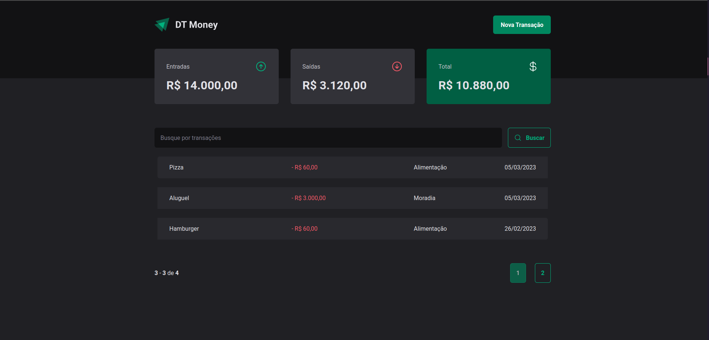
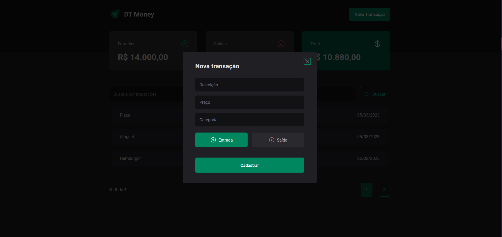

<h4 align="center"> 
	🚧  💸 DT-Money 1.0 💸  🚀 em construção... 🚧
</h4>

  

  
  

 

  
   

## 💻 Sobre o projeto

💸 DT-Money - é um sistema de controle financeiro, entradas e saídas e total, com cadastro de novas entradas e saídas, funcionalidade de buscas e filtros. Versão web e mobile adaptável.

Projeto desenvolvido no curso da trilha Ignite da [Rocketseat].

## 🎨 Layout

O layout da aplicação está disponível no Figma:

### Mobile

🚧 Em construção... 🚧

### Web

	

  	

## 🛠 Tecnologias

As seguintes ferramentas foram usadas na construção do projeto:

🚧 Em construção... 🚧

## 🚀 Como executar o projeto

🚧 Em construção... 🚧

## 📝 Licença

Este projeto esta sobe a licença MIT.

Feito com ❤️ por Edgard Finotti Neto 👋🏽 [Entre em contato!](https://www.linkedin.com/in/edgard-finotti-neto-a258b21a2/)

[nodejs]: https://nodejs.org/
[Typescript]: https://www.typescriptlang.org/
[expo]: https://expo.io/
[ReactJS]: https://reactjs.org
[rn]: https://facebook.github.io/react-native/
[yarn]: https://yarnpkg.com/
[vscode]: https://code.visualstudio.com/
[vceditconfig]: https://marketplace.visualstudio.com/items?itemName=EditorConfig.EditorConfig
[license]: https://opensource.org/licenses/MIT
[vceslint]: https://marketplace.visualstudio.com/items?itemName=dbaeumer.vscode-eslint
[prettier]: https://marketplace.visualstudio.com/items?itemName=esbenp.prettier-vscode
[Rocketseat]: https://rocketseat.com.br
[Styled Components]: https://styled-components.com/
[React Router DOM]:https://github.com/remix-run/react-router
[React Hook Form]:https://github.com/react-hook-form/react-hook-form
[Validação de Formulários com Biblioteca Zod]:https://github.com/colinhacks/zod
[ViaCEP]:https://viacep.com.br/
[Axios]: https://github.com/axios/axios
[Phosphor Icons]: https://github.com/phosphor-icons/react
[React Input Mask]: https://github.com/sanniassin/react-input-mask
[UUID]: https://github.com/uuidjs/uuid
[Context API]: https://reactjs.org/docs/context.html
[Redux]: https://react-redux.js.org/
[Effect Hook]: https://reactjs.org/docs/hooks-effect.html
